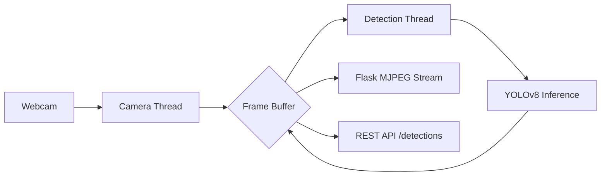

# 🏎️ STRIKER-YOLO: High-Performance Real-Time Object Detection

[](https://www.python.org/downloads/)
[](https://ultralytics.com/)
[](https://flask.palletsprojects.com/)
[](https://opencv.org/)

A professional-grade computer vision system engineered for low-latency, high-throughput object detection. This project demonstrates advanced integration of **YOLOv8**, **Multithreaded Video Processing**, and **Asynchronous API Design** to achieve real-time performance (60+ FPS) across industrial and consumer applications.

---

## 🚀 Key Technical Highlights

*   **⚡ 60+ FPS Real-Time Intelligence**: Achieved through a decoupled architecture where camera IO, AI inference, and web streaming run on independent execution threads.
*   **🧠 Optimized YOLOv8n Integration**: Utilizes FP16 half-precision and localized hardware acceleration (CUDA/Metal) for ultra-fast inference without compromising accuracy.
*   **🧵 Thread-Safe MJPEG Streaming**:Custom-built streaming server that ensures zero-frame-blocking, providing a smooth visual experience even under heavy computational load.
*   **🌐 RESTful Detection API**: Exposes a real-time JSON endpoint for seamless integration with external automation or analytics platforms.

---

## 🏗️ System Architecture

The system is designed with a **Non-Blocking Multithreaded Pipeline**:

1.  **Ingestion Layer**: Dedicated background thread for high-speed frame grabbing from USB/IP cameras.
2.  **Inference Layer**: Asynchronous YOLOv8 engine processing the latest available frame buffer.
3.  **Visualization Layer**: Real-time annotation engine for bounding boxes and dynamic FPS metrics.
4.  **Distribution Layer**: Flask-based MJPEG server and JSON API.



---

## 🛠️ Tech Stack

| Category | Technology | Usage |
| :--- | :--- | :--- |
| **Model** | **YOLOv8 (Ultralytics)** | State-of-the-Art Object Detection |
| **Vision** | **OpenCV** | Image Processing & Visualization |
| **Backend** | **Flask** | Web Server & REST API |
| **Concurrency** | **Threading** | Performance Optimization & Async IO |
| **Frontend** | **HTML5/CSS3** | Premium Dark-Mode Monitoring Dashboard |

---

## 📂 Project Structure

```text
├── app.py                # High-performance Flask server
├── detector.py           # Optimized YOLOv8 inference logic
├── camera.py             # Threaded frame acquisition engine
├── utils/
│   └── visualization.py  # Computer vision annotation utility
├── templates/
│   └── index.html        # Premium monitoring dashboard
├── models/               # Model weights storage
└── static/               # Frontend assets
```

---

## 🚦 Getting Started

### 1. Prerequisites
- Python 3.10+
- Webcam or Video Source

### 2. Installation
```bash
# Clone the repository
git clone https://github.com/yourusername/real-time-object-detection-yolo.git
cd real-time-object-detection-yolo

# Install dependencies
python -m pip install -r requirements.txt
```

### 3. Execution
```bash
python app.py
```
Open [http://localhost:5000](http://localhost:5000) in your browser to view the **STRIKER-YOLO Dashboard**.

---

## 📈 Future Roadmap
- [ ] **TensorRT Integration**: Further latency reduction for NVIDIA hardware.
- [ ] **Multi-Camera Support**: Simultaneous monitoring of multiple streams.
- [ ] **Cloud Sync**: Direct database logging of detection events for long-term analytics.

---

### 👨‍💻 Author
**Hari** - *Prompt Engineer & AI Developer*
> "Building high-performance AI systems that bridge the gap between research and production."
